# RaiseTech 第4回課題

1.VPC作成
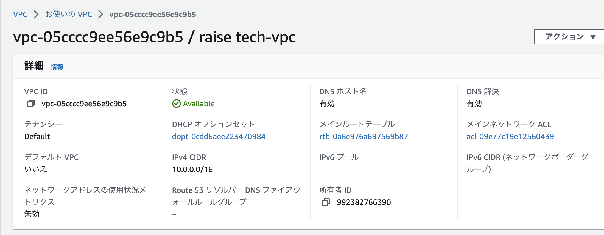
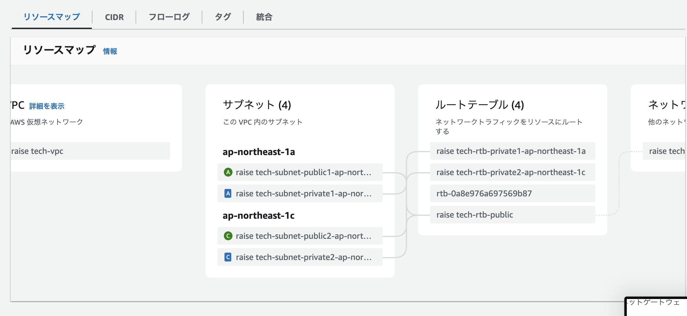

2.EC2作成
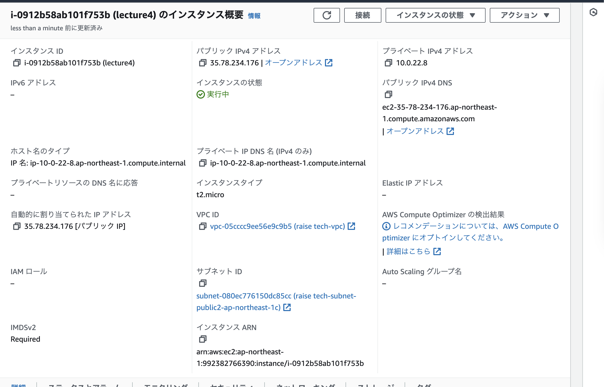
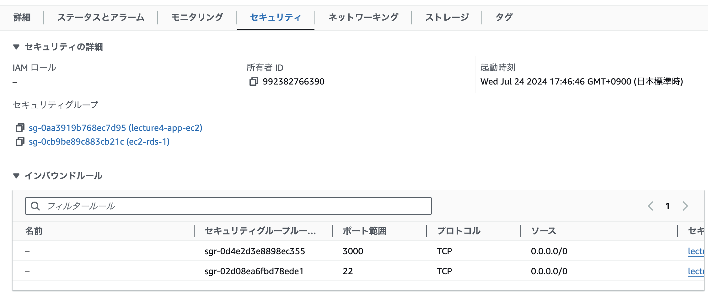

3.RDS作成
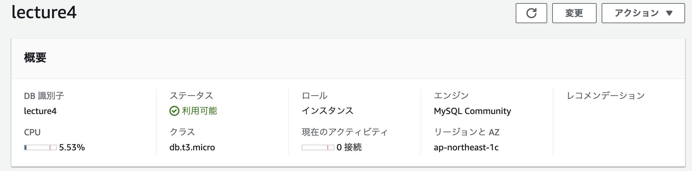
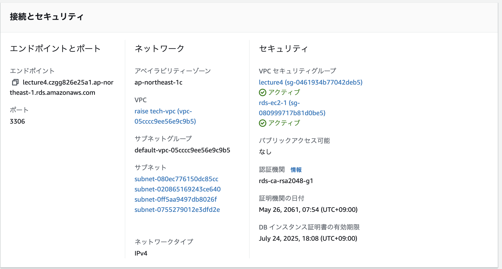
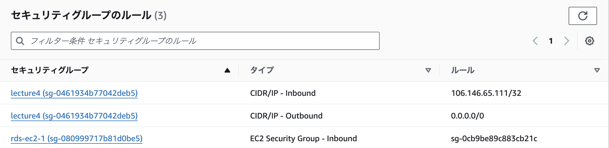
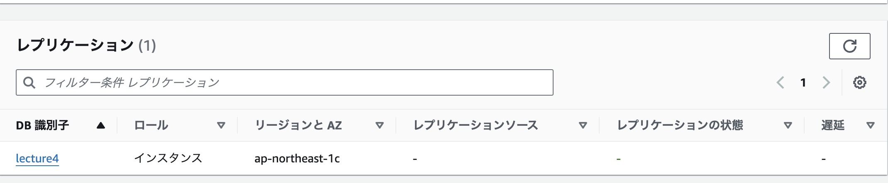

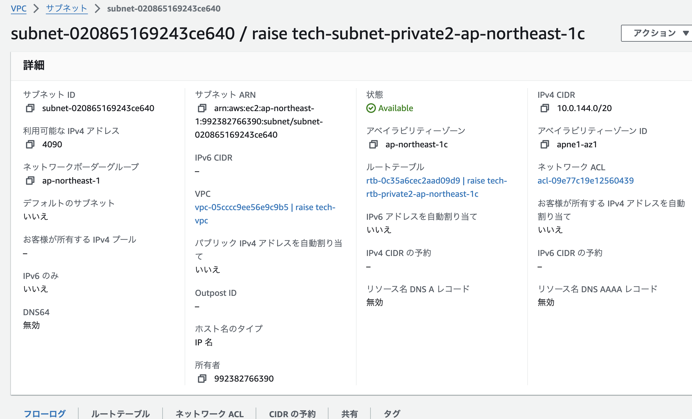
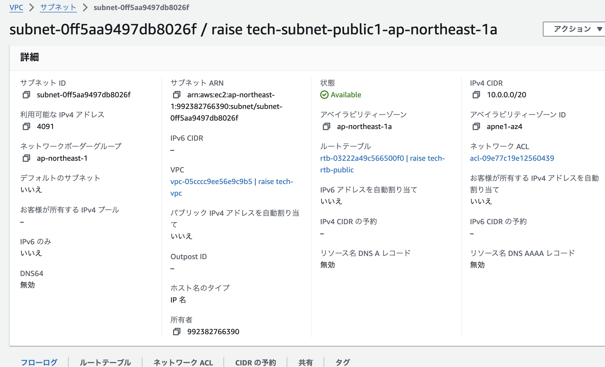
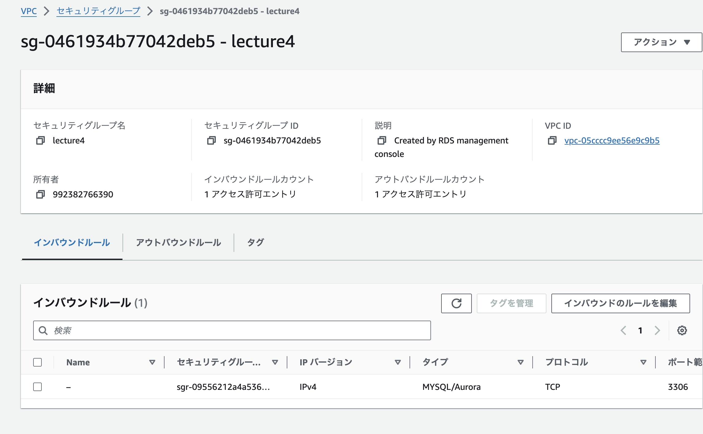

4.EC2からSSH接続

5.MySQLへ接続

## 今回の課題から学んだこと、感じたこと
・VPC、サブネットの構築
・EC2の構築
・RDSの構築

今回やってみて思ったより構築がうまくいかなかったり、言葉の意味がわからないことが少しあったなと思いました。

これは今後の自分の課題として学んでいきます。　

接続の時にmysqlへ接続するのに時間がかかってしまいました。

バージョンが違ったようで新しくダウンドードしたらなんとか接続に成功しました。

未経験で挫折しないように、小さな成功を積み重ねていきます。
