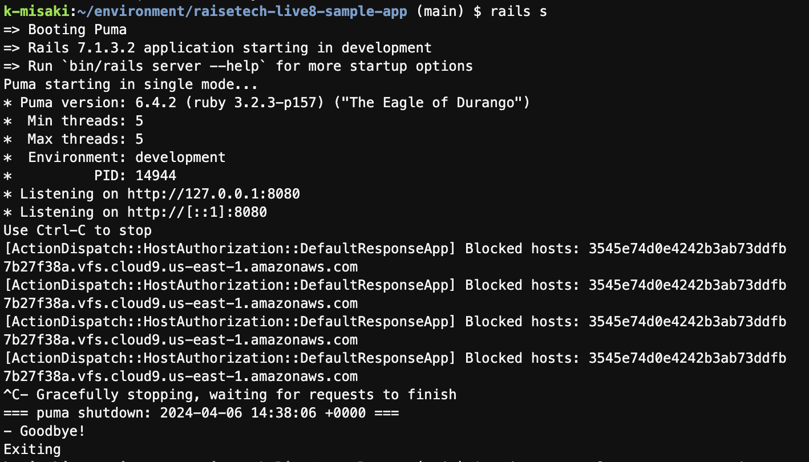
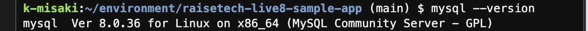
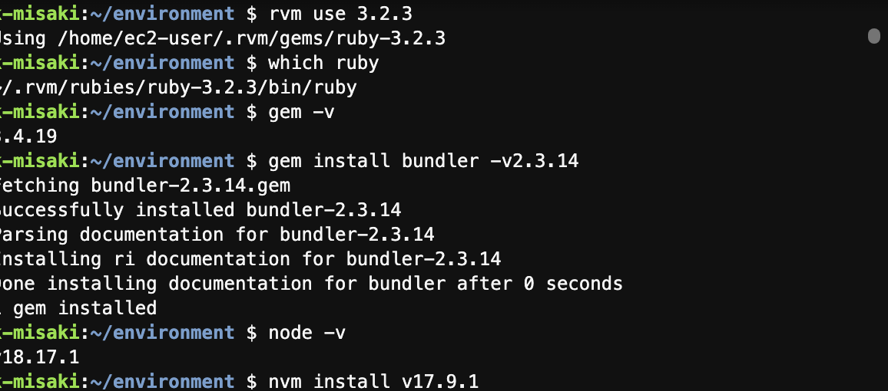

# RaiseTech第3回課題

## 1. APサーバーについて
### <APサーバーの名前とバージョン>
- Puma version:6.4.2

### <APサーバーを終了させた場合、引き続きアクセスできるのか>
- できない
- 再起動の場合はできる

## 2. DBサーバーについて
### <DBサーバーの名前とバージョン>
- MySQL version:8.0.36 for Linux on x86_64(MySQL Community Server -GPL)

### <DBバージョンを終了した場合、引き続きアクセスできるのか>
- できない

### <Railsの構成管理ツール>
- Bundler:v2.3.14

## 3. <課題から学んだこと・感じたこと>
今回エラーメッセージ続きで本当に苦労しました。エラーメッセージを日本語に直して、意味を調べ理解していくのが大変でした。
結果的には自分の凡ミスが原因と分かりました。

そのままコピー&ペーストしているつもりが、列が少しずれていることでエラーメッセージに繋がるのだと知りました。
少しのミスがこんなに見つけるのが大変なのだと身をもって感じました。

これからは、自分がミスしてしまったことを含め見直しをしっかりしようと思いました。
全てを理解するのには時間がかかるため、何度も練習して理解を深めていきます。
